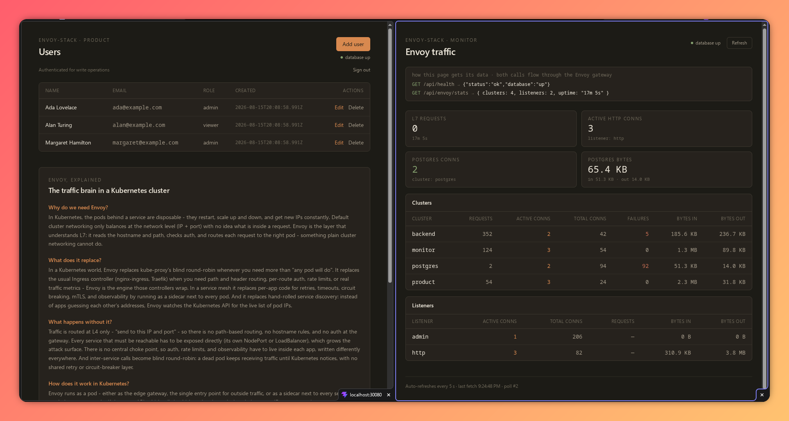

# Envoy Full-Stack K8s Reference Stack


A production-shaped, containerized full-stack reference application: a CRUD
product frontend, a Prometheus + Grafana monitoring stack, a NestJS backend,
PostgreSQL, and Envoy Proxy as the **single** network ingress - deployed to
Kubernetes with Kustomize on k3d.

## Preview



## Quick start (k3d)

One command brings up the whole stack - builds images, creates the cluster,
imports the images, creates the DB secret, applies the manifests, and waits
for everything to be ready:

```bash
./scripts/k3d-up.sh      # stack up at http://localhost:30080/
./scripts/k3d-down.sh    # cluster deleted, images removed, nothing left running
```

Open:

| URL | What |
|---|---|
| http://localhost:30080/ | Product app (CRUD) |
| http://localhost:30080/grafana | Grafana (basic auth, then login: admin / envoy-stack) |
| http://localhost:30080/prometheus | Prometheus (basic auth) |
| http://localhost:30080/api/users | Raw API (read) |

Default basic-auth credentials: **`admin` / `envoy-stack`** (see
[Changing the auth credentials](#changing-the-auth-credentials)).

`k3d-up.sh` is idempotent - re-running it rebuilds and re-imports images and
re-applies the manifests against the existing cluster. The `prod` overlay
(`kubectl apply -k kustomize/overlays/prod`) is the only manual variant, for
3x replicas and larger limits.

### What the script does (the underlying commands)

```bash
docker build -t envoy-stack/product:dev frontend/product
docker build -t envoy-stack/backend:dev backend

k3d cluster create envoy-stack --port 30080:30080@loadbalancer --wait
k3d image import envoy-stack/product:dev envoy-stack/backend:dev -c envoy-stack

kubectl create secret generic db-creds \
  --from-literal=POSTGRES_USER=postgres \
  --from-literal=POSTGRES_PASSWORD=postgres \
  --from-literal=POSTGRES_DB=app \
  --dry-run=client -o yaml | kubectl apply -f -   # idempotent

kubectl apply -k kustomize/base --prune -l stack=envoy-stack

# Postgres first: the deployments' readiness gate is the DB-backed /api/health,
# so the StatefulSet must be Ready before they can converge.
kubectl rollout status statefulset -l stack=envoy-stack --timeout=240s
kubectl rollout status deployment -l stack=envoy-stack --timeout=240s
```

### Verify

```bash
curl http://localhost:30080/api/users      # seeded JSON rows
curl http://localhost:30080/api/health     # readiness: {"status":"ok","info":{...},"error":{},"details":{...}}
curl http://localhost:30080/api/healthz    # liveness: {"status":"ok"}

# write without creds → 401
curl -X POST http://localhost:30080/api/users \
  -H 'Content-Type: application/json' \
  -d '{"name":"Nope","email":"nope@example.com","role":"viewer"}'

# write with creds → 201
curl -u admin:envoy-stack -X POST http://localhost:30080/api/users \
  -H 'Content-Type: application/json' \
  -d '{"name":"Grace Testing","email":"grace.testing@example.com","role":"editor"}'

# monitoring is behind the same gateway (basic auth)
curl -u admin:envoy-stack http://localhost:30080/grafana/api/health
curl -u admin:envoy-stack http://localhost:30080/prometheus/-/ready

# all Prometheus scrape targets are UP (envoy, postgres, prometheus)
curl -u admin:envoy-stack \
  http://localhost:30080/prometheus/api/v1/targets \
  | grep -o '"health":"[a-z]*"' | sort -u    # expect only "up"

# DB recovery cycle: stop postgres → /api/health flips to 503 → back to 200
kubectl scale statefulset postgres --replicas=0
curl http://localhost:30080/api/health       # {"status":"error",...} → 503
kubectl scale statefulset postgres --replicas=1
curl http://localhost:30080/api/health       # {"status":"ok",...} → 200 within ~10 s, no backend restart
```

Notes:

- k3s ships the `local-path` StorageClass by default, so the Postgres PVC
  binds automatically - no storage provisioner setup needed.
- Database credentials are intentionally **not** in any manifest; the secret
  is created at up time.
- The only externally reachable Service is Envoy's L7 gateway (NodePort
  `30080`), so all routes land on `localhost:30080`.

Preview overlays without applying:

```bash
kubectl kustomize kustomize/base
kubectl kustomize kustomize/overlays/dev
kubectl kustomize kustomize/overlays/prod
```

## Features

- **Single L7 gateway** - one Envoy route table fans out to product, backend,
  and the monitoring tools (Grafana + Prometheus).
- **L4 Postgres proxying** - the backend never dials Postgres directly; every
  SQL conversation flows through Envoy, so Envoy's live counters prove the
  database path is real. The postgres-exporter dials through the same L4
  proxy.
- **Per-route basic auth** - write endpoints and the monitoring UIs are gated
  by Envoy's `basic_auth` filter; read endpoints stay open. Auth is enforced
  at the gateway, never in the app.
- **Prometheus + Grafana monitoring** - Prometheus scrapes Envoy's native
  `/stats/prometheus` endpoint and the Postgres exporter; Grafana ships a
  pre-provisioned Envoy dashboard behind the same gateway.
- **Environment parity** - `dev` and `prod` Kustomize overlays differ only by
  tuning (replicas, resources, image tags), never by structure.

## Architecture

```
               ┌─▶ /            Product (React + Nginx, CRUD UI)       [open]
Browser ──▶ Envoy (L7 :80) ─┼─▶ /grafana*    Grafana                  [auth]
               └─▶ /prometheus* Prometheus                           [auth]
                    /api/*    Backend (NestJS :3000)  GET/HEAD [open]
                                                        POST/PUT/DELETE [auth]

Backend ──▶ Envoy (L4 :1999) ──▶ PostgreSQL 5432   (raw TCP, proxied)
postgres-exporter ──▶ Envoy (L4 :1999) ──▶ PostgreSQL 5432
Prometheus ──▶ Envoy (admin :9901)            (/stats/prometheus, in-cluster)
```

### L7 route table (Envoy, port 80)

| Path | Cluster | Auth |
|---|---|---|
| `/grafana*` | grafana (port 3000) | required |
| `/prometheus*` | prometheus (port 9090) | required |
| `/api/*` GET/HEAD | backend (NestJS, port 3000) | open |
| `/api/*` POST/PUT/DELETE | backend | required |
| `/` (and SPA fallback) | product (Nginx, port 80) | open |

### L4 route table (Envoy, port 1999)

| Listener | Protocol | Cluster |
|---|---|---|
| `postgres_listener` | raw TCP (Postgres wire) | postgres (port 5432) |

### Backend API

| Endpoint | Method | Auth | Notes |
|---|---|---|---|
| `/api/users` | GET | no | list users (JSON) |
| `/api/users` | POST | yes | create user, `201` |
| `/api/users/:id` | PUT | yes | update user |
| `/api/users/:id` | DELETE | yes | delete user |
| `/api/health` | GET | no | readiness, Terminus shape: `200` all deps up / `503` on DB down |
| `/api/healthz` | GET | no | liveness: always `200` while the process is alive |

### Monitoring

Prometheus (port 9090) scrapes three targets: Envoy's admin interface at
`envoy-l4:9901/stats/prometheus` (native Prometheus format, no exporter
needed), the postgres-exporter at `postgres-exporter:9187`, and itself.
Grafana (port 3000) is pre-provisioned with a Prometheus datasource and an
"Envoy Stack" dashboard covering traffic and latency (percentiles), error and
retry rates, upstream health, memory, the L4 Postgres proxy, and app/database
stats like the live user count. Both are reached through the Envoy gateway at
`/prometheus` and `/grafana`, behind the same basic auth; their internal
service-to-service traffic stays in-cluster.

## Tech stack

| Layer | Choice |
|---|---|
| Frontend | React 19 + Vite + Tailwind v4, served by Nginx (product app) |
| Backend | NestJS 11 + TypeORM + Terminus (`@nestjs/terminus` health) |
| Database | PostgreSQL 18, seeded by `init.sql` on first boot |
| Gateway | Envoy Proxy v1.39.0 (L7 + L4 listeners, `basic_auth`, admin stats) |
| Monitoring | Prometheus v2.53, Grafana 11.5, postgres-exporter v0.16 |
| Deployment | Kustomize base/dev/prod on k3d (k3s) |

## Prerequisites

- Docker (to build the images)
- k3d v5+ (runs k3s; provides the cluster and image import)
- `kubectl` 1.27+ (ships built-in Kustomize)
- Node 22+ (NestJS backend; `npm install` + `npm run dev` in `backend/`)

## Security notes

- **No secrets in YAML.** DB credentials come from the `db-creds` Secret
  (created at up time); Envoy's auth users come from a generated Secret
  (`envoy-users`) built by Kustomize from the hashed `users.htpasswd`. The
  htpasswd file holds `{SHA}` hashes, never plaintext passwords.
- **Exposure.** Only the `envoy` L7 Service (NodePort) is external. The L4
  proxy and admin stats are ClusterIP-only (`envoy-l4`), reachable only from
  inside the cluster.
- **Read vs write.** `GET /api/*` is open; POST/PUT/DELETE, `/grafana*` and
  `/prometheus*` require basic auth, enforced at the gateway (Envoy), not in
  the app.

### Changing the auth credentials

Generate a new htpasswd line. Envoy's `{SHA}` hashes the **password alone**
(not `user:password`):

```bash
printf '%s' 'your-new-password' | openssl dgst -sha1 -binary | base64
# → write "admin:{SHA}<hash>" to envoy/users.htpasswd
```

Then sync the packaged copy into `kustomize/base/` and restart Envoy:

```bash
./scripts/sync-configs.sh
kubectl rollout restart deployment/envoy
```

## Development

- **Config sync contract.** `envoy/envoy.yaml`, `postgres/init.sql` and
  `envoy/users.htpasswd` are the canonical sources. `kustomize/base/` holds
  generated snapshots of them (Kustomize cannot read files above its
  kustomization root). After editing a canonical file, run
  `./scripts/sync-configs.sh` and commit the sync. Never hand-edit the
  snapshots.
- **Frontend.** `cd frontend/product && npm run dev` (Vite on `:5173`).
- **Backend.** `cd backend && npm run dev`. For component-local work point it
  at Postgres directly (`PG_HOST=localhost PG_PORT=5432`), or run the full
  stack with `./scripts/k3d-up.sh` to exercise the L4 proxy end to end.
- **Checks.** `npm run lint`, `npm run build` (frontend), `npm run typecheck`
  (backend), and validate the Envoy config:

  ```bash
  docker run --rm \
    -v $PWD/envoy/envoy.yaml:/etc/envoy/envoy.yaml:ro \
    -v $PWD/envoy/users.htpasswd:/etc/envoy/users.htpasswd:ro \
    envoyproxy/envoy:v1.39.0 --mode validate -c /etc/envoy/envoy.yaml
  ```

## Out of scope (v1)

User accounts/JWT auth (Envoy basic auth only), TLS termination at Envoy,
metrics scraping/tracing, Postgres HA/replication, Helm, CI/CD.
